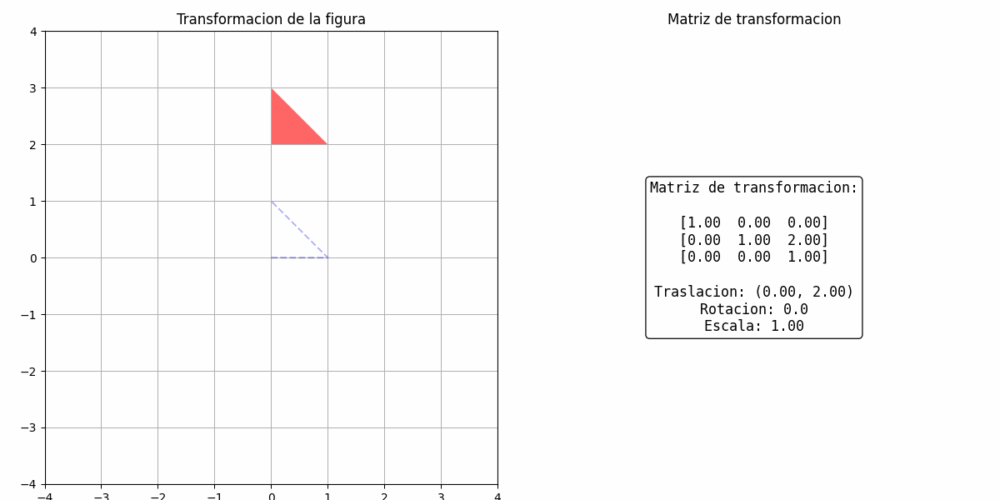

# Taller de Transformaciones Básicas

Este repositorio contiene implementaciones de transformaciones geométricas básicas (traslación, rotación y escalado) en tres entornos diferentes: Python (con Matplotlib), Processing y Three.js (con React).

## 1. Implementación en Python

### Descripción
Implementación en Python usando NumPy y Matplotlib que aplica transformaciones a un triángulo 2D. Genera una animación que muestra:
- Traslación en una trayectoria circular
- Rotación sobre su propio centro
- Escalado variable en función del tiempo

### Características principales
- Utiliza matrices de transformación homogéneas (3x3)
- Muestra la matriz aplicada junto a la visualización
- Crea una animación GIF que muestra todo el ciclo de transformaciones

### Código relevante

```python
# Funciones para crear matrices de transformación
def traslacion_matriz(tx, ty):
    return np.array([
        [1, 0, tx],
        [0, 1, ty],
        [0, 0, 1]
    ])

def rotacion_matriz(angulo_grados):
    angulo_rad = np.radians(angulo_grados)
    cos_theta = np.cos(angulo_rad)
    sin_theta = np.sin(angulo_rad)
    return np.array([
        [cos_theta, -sin_theta, 0],
        [sin_theta,  cos_theta, 0],
        [0,          0,         1]
    ])

def escala_matriz(sx, sy):
    return np.array([
        [sx, 0,  0],
        [0,  sy, 0],
        [0,  0,  1]
    ])

# Aplicar transformaciones en cada frame de la animación
for i in range(num_frames):
    t = i / (num_frames - 1)
    
    # Calcular parámetros de transformación en función de t
    angulo = 360 * t
    escala_factor = 1 + 0.5 * np.sin(2 * np.pi * t)
    tx = 2 * np.sin(2 * np.pi * t)
    ty = 2 * np.cos(2 * np.pi * t)
    
    # Construir y combinar matrices de transformación
    T = traslacion_matriz(tx, ty)
    R = rotacion_matriz(angulo)
    S = escala_matriz(escala_factor, escala_factor)
    
    # Combinar transformaciones: primero escalar, luego rotar, luego trasladar
    M = T @ R @ S
```

### Resultado
El resultado es una animación GIF que muestra el triángulo transformándose con la matriz aplicada mostrada al lado.



*Nota: El GIF muestra un triángulo rojo que se traslada, rota y escala, con la matriz de transformación visible.*

## 2. Implementación en Processing

### Descripción
Implementación en Processing que crea una esfera 3D animada con las tres transformaciones básicas:
- Traslación en trayectoria sinusoidal
- Rotación en múltiples ejes
- Escalado variable con el tiempo

### Características principales
- Utiliza el modo 3D de Processing (P3D)
- Aplica iluminación para mejor visualización 3D
- Anima el color de la esfera según el tiempo
- Muestra información en tiempo real sobre los parámetros de transformación

### Código relevante

```processing
void draw() {
  // Trasladamos al centro de la pantalla
  translate(width/2, height/2, 0);
  
  // Traslación ondulada en X
  float xOffset = sin(frameCount * 0.02) * 150;
  translate(xOffset, 0, 0);
  
  // Rotación en tres ejes
  rotateX(frameCount * 0.01);
  rotateY(frameCount * 0.02);
  rotateZ(frameCount * 0.005);
  
  // Escalado variable
  float scaleFactor = map(sin(frameCount * 0.03), -1, 1, 0.5, 1.5);
  scale(scaleFactor);
  
  // Dibujamos la esfera
  sphere(100);
}
```

### Resultado
Una animación en tiempo real de una esfera 3D que cambia de color mientras se traslada, rota y escala de manera fluida.


*Nota: Para ver la animación, ejecuta el sketch en Processing.*

## 3. Implementación en Three.js con React

### Descripción
Implementación en React Three Fiber (Three.js) que crea un nudo toroidal (Torus Knot) multicolor con animaciones de:
- Traslación en trayectoria circular
- Rotación en múltiples ejes
- Escalado pulsante

### Características principales
- Utiliza React Three Fiber para integrar Three.js con React
- Implementa coloración por vértice para crear bandas de color en el nudo toroidal
- Usa material físico con efecto clearcoat para mayor realismo
- Incorpora controles orbitales para navegación interactiva

### Código relevante

```javascript
function MultiColorTorusKnot() {
  const groupRef = useRef<THREE.Group>(null)
  
  useFrame(({ clock }) => {
    if (!groupRef.current) return
    
    const elapsedTime = clock.getElapsedTime()
    
    // Translate along a sinusoidal path
    groupRef.current.position.x = Math.sin(elapsedTime) * 2
    groupRef.current.position.y = Math.cos(elapsedTime) * 2
    
    // Rotate on its own axis
    groupRef.current.rotation.x += 0.01
    groupRef.current.rotation.y += 0.005
    groupRef.current.rotation.z += 0.002
    
    // Scale smoothly using a temporal function
    const scale = 1 + Math.sin(elapsedTime) * 0.2
    groupRef.current.scale.set(scale, scale, scale)
  })
  
  // Create a torus knot with vertex colors
  const torusKnot = useMemo(() => {
    const geometry = new THREE.TorusKnotGeometry(0.7, 0.3, 128, 32, 2, 3)
    const colors = []
    const vertexCount = geometry.getAttribute('position').count
    
    // Assign colors to vertices based on angle
    for (let i = 0; i < vertexCount; i++) {
      const x = geometry.getAttribute('position').getX(i)
      const y = geometry.getAttribute('position').getY(i)
      const angle = Math.atan2(y, x)
      const normalizedAngle = (angle + Math.PI) / (Math.PI * 2)
      const colorIndex = Math.floor(normalizedAngle * 6) % 6
      const color = colorArray[colorIndex]
      colors.push(color.r, color.g, color.b)
    }
    
    geometry.setAttribute('color', new THREE.Float32BufferAttribute(colors, 3))
    
    return (
      <mesh castShadow>
        <primitive object={geometry} attach="geometry" />
        <meshPhysicalMaterial
          vertexColors
          roughness={0.0}
          metalness={0.1}
          clearcoat={1.0}
          clearcoatRoughness={0.1}
          emissive="#ffffff"
          emissiveIntensity={0.3}
          reflectivity={1}
        />
      </mesh>
    )
  }, [])
}
```

### Resultado
Una aplicación web interactiva que muestra un nudo toroidal con colores vibrantes que se mueve, rota y escala en un entorno 3D.


*Nota: Para ver la implementación, ejecuta la aplicación React con `npm run dev` desde la carpeta del proyecto.*

## Ejecución

### Python
1. Asegúrate de tener instalado Python con NumPy, Matplotlib e imageio
2. Ejecuta el notebook `TransformacionesBásicas.ipynb`

### Processing
1. Abre el archivo `TransformacionesB_sicas.pde` con Processing
2. Presiona el botón Run

### Three.js (React)
1. Navega a la carpeta `threejs/TransformacionesBasicas`
2. Instala las dependencias: `npm install`
3. Ejecuta el servidor de desarrollo: `npm run dev`
4. Abre el navegador en la URL indicada (generalmente http://localhost:5173)
