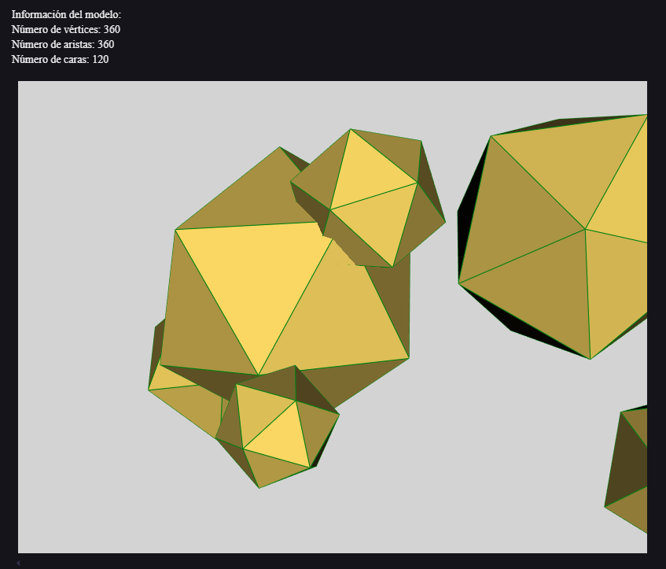

# 🧪 Taller: Estructuras 3D

## 📅 Fecha
`2025-05-02`

---

## 🎯 Objetivo del Taller

Este taller busca explorar cómo construir y visualizar un mundo 3D a partir de un modelo en formato OBJ, permitiendo la visualizacion de vértices, aristas y caras, generando animaciones de rotación con Python, e integrando posteriormente un modelo en un entorno web 3D mediante React Three Fiber.

---

## 🧠 Conceptos Aprendidos

Lista de conceptos clave aplicados en el taller:

- [ ] Carga y manipulación de mallas 3D (formato `.obj`)
- [ ] Visualización 3D en Python (`trimesh`, `vedo`)
- [ ] Generación de animaciones GIF a partir de visualizaciones 3D
- [ ] Renderizado 3D en tiempo real en el navegador con React Three Fiber (`@react-three/drei ` y `@react-three/fiber`)
- [ ] Carga de modelos OBJ en Three.js (`OBJLoader`)
- [ ] Uso de controles de cámara (`OrbitControls`)

---

## 🔧 Herramientas y Entornos

Especifica los entornos usados:

- JavaScript / React (`react`, `@react-three/fiber`, `@react-three/drei`)
- Python (`trimesh`, `vedo`, `numpy`, `imageio`)
- Node.js / Vite / npm para el entorno de desarrollo web
- Jupyter Notebook (`.ipynb`) para el código Python


---

## 📁 Estructura del Proyecto

```
2025-05-02_taller_estructuras_3d/
├── python/               # Implementación en Python (visual.ipynb), modelo (three.obj), resultado (rotacion.gif)
├── threejs/              # Implementación en React Three Fiber (App.jsx, etc.)
│   └── public/models/    # Contiene el modelo 'girl OBJ.obj' usado en la app web
├── README.md             # Este archivo
```

---

## 🧪 Implementación


### 🔹 Etapas realizadas

#### 🐍 Python
1. Instalación de librerías Python con pip install.
2. Carga del modelo `three.obj` 
3. Procesamiento del modelo
4. visualización del modelo.
5. Generación de una animación rotacional (`rotacion.gif`)

#### 🌐 React Three Fiber 
1.  Configuración del proyecto React con Vite y dependencias (`@react-three/fiber`, `@react-three/drei`, `three`).
2.  Creación de un componente `Model` que carga un modelo `girl OBJ.obj` usando `OBJLoader`.
3.  Implementación de lógica para renderizar el modelo en tres modos distintos: caras (`mesh`), aristas (`lineSegments`), y vértices (`points`).
4.  Cálculo y visualización del número total de vértices del modelo cargado.
5.  Creación de una interfaz de usuario (`App` y CSS) con botones para cambiar el `viewMode` (caras, aristas, puntos) y mostrar el contador de vértices.
6.  Integración en un `Canvas` de React Three Fiber con iluminación ambiental/direccional y `OrbitControls`.

### 🔹 Código relevante

#### 🐍 Python 
```python

# Extraer la malla del modelo
if isinstance(modelo, trimesh.Scene):
    if len(modelo.geometry) > 0:
        nombre_malla = list(modelo.geometry.keys())[0]
        malla = modelo.geometry[nombre_malla]
    else:
        raise ValueError("No se encontraron mallas en la escena")
else:
    malla = modelo  


def crear_animacion():
    """Genera una animación de la malla rotando y la guarda como GIF"""
    visualizador_anim = vedo.Plotter(offscreen=True, bg='lightgray')
    objeto_3d = vedo.Mesh([malla.vertices, malla.faces])
    objeto_3d.c(color_caras).lc(color_aristas).lw(1)  

    fotogramas = []
    for angulo in np.linspace(0, 360, 60):  # 60 fotogramas en lugar de 72
        visualizador_anim.show(objeto_3d, azimuth=angulo)
        fotogramas.append(visualizador_anim.screenshot(asarray=True))
    
    # Guardar animación
    imageio.mimsave('rotacion.gif', fotogramas, fps=15, loop=0)
    return Image("rotacion.gif") 
```

#### 🌐 React Three Fiber (`threejs/src/App.jsx`)
*Explicación: Componente principal que configura la escena 3D, carga el modelo y maneja la interfaz para cambiar vistas.*
```jsx
import React, { useState, useMemo } from 'react'
import { Canvas, useLoader } from '@react-three/fiber'
import { OrbitControls } from '@react-three/drei'
import { OBJLoader } from 'three/examples/jsm/loaders/OBJLoader'
import './App.css'

// ... (Componente Model como se muestra en App.jsx) ...

export default function App() {
  const [viewMode, setViewMode] = useState('faces')
  const [vertexCount, setVertexCount] = useState(0)

  return (
    <div className='container'>
      <Canvas shadows camera={{ position: [0, 0, 3], fov: 50 }}>
        <ambientLight intensity={0.5} />
        <directionalLight position={[5, 5, 5]} intensity={1} />
        <Model viewMode={viewMode} onVertexCount={setVertexCount} />
        <OrbitControls />
      </Canvas>

      <div className='controls'>
        {/* Botones para cambiar viewMode */}
        <button onClick={() => setViewMode('faces')} className={viewMode === 'faces' ? 'active' : ''}>Caras</button>
        <button onClick={() => setViewMode('edges')} className={viewMode === 'edges' ? 'active' : ''}>Aristas</button>
        <button onClick={() => setViewMode('points')} className={viewMode === 'points' ? 'active' : ''}>Vértices</button>
        <div className='info'>Vértices: {vertexCount}</div>
      </div>
    </div>
  )
}
```

---

## 📊 Resultados Visuales

### 📌 Este taller **requiere explícitamente un GIF animado**:

> ✅ Si tu taller lo indica, debes incluir **al menos un GIF** mostrando la ejecución o interacción.

- **El nombre del GIF debe ser descriptivo del punto que estás presentando.**

#### 🐍 Python
Se generó una animación mostrando la rotación del modelo `three.obj` y los respectivos datos del modelo.



#### 🌐 React Three Fiber
Se implementó una aplicación web que permite visualizar el modelo `girl OBJ.obj` en diferentes modos (caras, aristas, vértices) y muestra el número total de vértices.


---

## 🧩 Prompts Usados (Ejemplos)

```text
"Cómo cargar un archivo OBJ en Python usando trimesh"
"Generar un GIF de rotación de una malla 3D con vedo en Python"
"Cómo crear un componente de React para cargar un modelo OBJ usando Three.js"
"Cómo implementar controles de cámara en React Three Fiber"
```

---

## 💬 Reflexión Final


- Este taller proporcionó experiencia práctica en el flujo de trabajo completo de manejo de modelos 3D, desde el procesamiento backend con Python hasta la visualización interactiva frontend con React Three Fiber. Se reforzó la comprensión de las estructuras de datos de mallas (vértices, caras, aristas) y las diferentes formas de representarlas visualmente.
- Un aspecto interesante fue la integración de bibliotecas de Python para tareas como la generación de animaciones (`rotacion.gif`) y el uso de React Three Fiber para crear una experiencia web inmersiva. La principal dificultad podría residir en asegurar la compatibilidad de formatos y la correcta carga/interpretación de los datos del modelo OBJ en ambos entornos (Python y Three.js/JavaScript), así como la gestión del estado en React para la interfaz interactiva. La diferencia observada entre los modelos OBJ utilizados (`three.obj` vs `girl OBJ.obj`) también es un punto a considerar o corregir.
- Para futuras mejoras, se podría explorar la aplicación de texturas o materiales más complejos en Three.js, sincronizar el modelo usado entre Python y la web, añadir más opciones de interacción (como selección de partes del modelo) o investigar optimizaciones de rendimiento para modelos más grandes.

