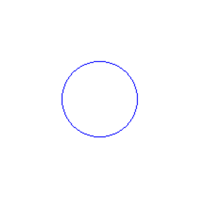

# 🧪 Taller: Algoritmos de Rasterización Básica

## 📅 Fecha
`2025-05-03`

---

## 🎯 Objetivo del Taller

Comprender e implementar los algoritmos clásicos de rasterización para líneas, círculos y triángulos, entendiendo cómo se construyen imágenes píxel a píxel en una pantalla. El objetivo es desarrollar una base sólida sobre cómo se generan primitivas gráficas sin usar librerías de alto nivel.

---

## 🧠 Conceptos Aprendidos

Lista de conceptos clave aplicados en el taller:

- [ ] Algoritmo de Bresenham para dibujo de líneas
- [ ] Algoritmo de punto medio para dibujo de círculos
- [ ] Rasterización de triángulos mediante scanline
- [ ] Manipulación directa de píxeles en una imagen
- [ ] Interpolación de coordenadas para el rellenado de formas
- [ ] Visualización de gráficos generados mediante algoritmos

---

## 🔧 Herramientas y Entornos

Especifica los entornos usados:

- Python
  - Pillow (PIL) para creación y manipulación de imágenes
  - matplotlib para visualización de resultados
  - Jupyter Notebook para desarrollo interactivo

---

## 📁 Estructura del Proyecto

```
2025-04-03_taller_algoritmos_rasterizacion_basica/
├── python/               # Implementación en Python (rasterizacion_algoritmos.ipynb)
├── resultados/           # Imágenes generadas (linea.png, circulo.png, triangulo.png)
├── README.md             # Este archivo
```

---

## 🧪 Implementación

### 🔹 Etapas realizadas

#### 1. Preparación del entorno de dibujo
Se configuró un lienzo en blanco usando PIL (Python Imaging Library) donde se dibujarán los elementos.

#### 2. Implementación del algoritmo de Bresenham para líneas
Se implementó el algoritmo clásico de Bresenham que dibuja líneas de forma eficiente determinando qué píxeles activar.

#### 3. Implementación del algoritmo de punto medio para círculos
Se realizó la implementación del algoritmo de punto medio que permite dibujar círculos de manera eficiente.

#### 4. Implementación de relleno de triángulos mediante scanline
Se desarrolló un algoritmo para rellenar triángulos usando la técnica de barrido (scanline) con interpolación.

#### 5. Visualización de resultados
Se mostraron los resultados usando matplotlib para verificar el correcto funcionamiento de los algoritmos.

### 🔹 Código relevante

#### Configuración del entorno

```python
from PIL import Image, ImageDraw
import matplotlib.pyplot as plt

width, height = 200, 200
image = Image.new('RGB', (width, height), 'white')
pixels = image.load()
```

#### Algoritmo de Bresenham para líneas

```python
def bresenham(x0, y0, x1, y1):
    dx = abs(x1 - x0)
    dy = abs(y1 - y0)
    sx = 1 if x0 < x1 else -1
    sy = 1 if y0 < y1 else -1
    err = dx - dy

    while True:
        pixels[x0, y0] = (255, 0, 0)  # Color rojo
        if x0 == x1 and y0 == y1:
            break
        e2 = 2 * err
        if e2 > -dy:
            err -= dy
            x0 += sx
        if e2 < dx:
            err += dx
            y0 += sy
```

#### Algoritmo de punto medio para círculos

```python
def midpoint_circle(x0, y0, radius):
    x = radius
    y = 0
    p = 1 - radius

    while x >= y:
        for dx, dy in [(x, y), (y, x), (-x, y), (-y, x), (-x, -y), (-y, -x), (x, -y), (y, -x)]:
            if 0 <= x0 + dx < width and 0 <= y0 + dy < height:
                pixels[x0 + dx, y0 + dy] = (0, 0, 255)  # Color azul
        y += 1
        if p <= 0:
            p = p + 2*y + 1
        else:
            x -= 1
            p = p + 2*y - 2*x + 1
```

#### Algoritmo de relleno de triángulos

```python
def fill_triangle(p1, p2, p3):
    # ordenar por y
    pts = sorted([p1, p2, p3], key=lambda p: p[1])
    (x1, y1), (x2, y2), (x3, y3) = pts

    def interpolate(y0, y1, x0, x1):
        if y1 - y0 == 0: return []
        return [int(x0 + (x1 - x0) * (y - y0) / (y1 - y0)) for y in range(y0, y1)]

    x12 = interpolate(y1, y2, x1, x2)
    x23 = interpolate(y2, y3, x2, x3)
    x13 = interpolate(y1, y3, x1, x3)

    x_left = x12 + x23
    for y, xl, xr in zip(range(y1, y3), x13, x_left):
        for x in range(min(xl, xr), max(xl, xr)):
            if 0 <= x < width and 0 <= y < height:
                pixels[x, y] = (0, 255, 0)  # Color verde
```

---

## 📊 Resultados Visuales

### Línea usando Bresenham
La implementación del algoritmo de Bresenham dibuja una línea roja desde (20, 20) hasta (180, 120).


### Círculo usando algoritmo de punto medio
El algoritmo de punto medio dibuja un círculo azul centrado en (100, 100) con radio 40.


### Triángulo relleno usando scanline
El algoritmo de relleno de triángulos dibuja un triángulo verde con vértices en (30, 50), (100, 150) y (160, 60).


---

## 💬 Reflexión Final

- El algoritmo de Bresenham para líneas es muy eficiente porque solo utiliza operaciones de enteros (sumas, restas y multiplicaciones por 2), evitando operaciones de punto flotante más costosas.

- El algoritmo de punto medio para círculos aprovecha la simetría de los círculos para dibujar los 8 octantes simultáneamente, reduciendo significativamente la cantidad de cálculos necesarios.

- El algoritmo de relleno de triángulos mediante scanline es más complejo pero proporciona un método eficiente para rellenar polígonos complejos, interpolando entre los bordes para determinar qué píxeles rellenar.

- Una diferencia fundamental entre estos algoritmos es su complejidad: el de Bresenham para líneas es O(max(dx, dy)), el de punto medio para círculos es O(r) donde r es el radio, y el de relleno de triángulos es O(n) donde n es el área del triángulo.

- Estos algoritmos fundamentales demuestran cómo, a pesar de la disponibilidad de bibliotecas gráficas de alto nivel hoy en día, entender los principios básicos de rasterización sigue siendo crucial para comprender cómo funcionan los sistemas gráficos a bajo nivel.
