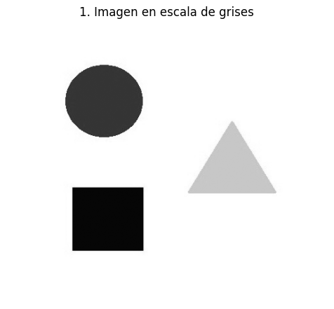
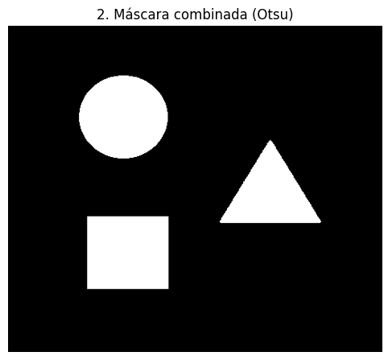
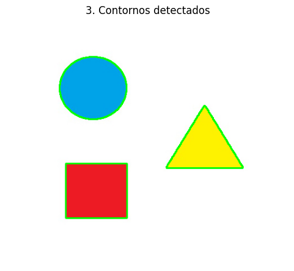
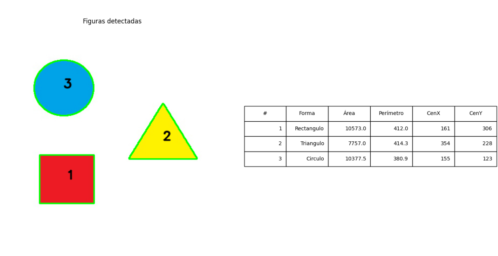

# 🧪 Taller - Análisis de Figuras Geométricas: Centroide, Área y Perímetro

## 📅 Fecha
`2025-05-03` 

---

## 🎯 Objetivo del Taller

Detectar formas simples (círculos, cuadrados, triángulos) en imágenes binarizadas y calcular propiedades geométricas como área, perímetro y centroide. El objetivo es desarrollar habilidades para extraer métricas relevantes de contornos detectados en imágenes procesadas.

---

## 🧠 Conceptos Aprendidos

- [ ] Cálculo de área con `cv2.contourArea()`
- [ ] Cálculo de perímetro con `cv2.arcLength()`
- [ ] Obtención del centroide usando momentos (`cv2.moments()`)
- [ ] Aproximación poligonal con `cv2.approxPolyDP()`
- [ ] Clasificación de formas geométricas según número de vértices

---

## 🔧 Herramientas y Entornos

- Python (`opencv-python`, `numpy`, `matplotlib`)
- Jupyter Notebook o Google Colab
- OpenCV para procesamiento de imágenes

---

## 📁 Estructura del Proyecto

```plaintext
2025-05-03_taller_analisis_figuras_geometricas/
├── python/                 # Script principal de análisis (AnalisisFiguras.py)
├── Capturas/               # Imágenes resultantes del proceso de análisis
├── README.md               # Documentación del taller
```  

---

## 🧪 Implementación

### 🔹 Etapas realizadas
1. Carga y conversión de la imagen a escala de grises.
2. Binarización usando el método de Otsu y segmentación HSV para detectar figuras amarillas.
3. Detección de contornos en la imagen binaria combinada.
4. Para cada contorno:
   - Cálculo de área y perímetro
   - Obtención del centroide usando momentos
   - Clasificación de la forma según número de vértices (triángulo, cuadrado/rectángulo, círculo)
5. Visualización de resultados con contornos etiquetados y tabla de métricas.

### 🔹 Código relevante

```python
# Detectar contornos
contours, _ = cv2.findContours(binary, cv2.RETR_LIST, cv2.CHAIN_APPROX_SIMPLE)

for idx, cnt in enumerate(contours, start=1):
    # Área y perímetro
    area = cv2.contourArea(cnt)
    peri = cv2.arcLength(cnt, True)

    # Calcular momentos y centroide
    M = cv2.moments(cnt)
    if M['m00'] != 0:
        cx = int(M['m10'] / M['m00'])
        cy = int(M['m01'] / M['m00'])
    else:
        cx, cy = 0, 0

    # Aproximar polígono para clasificación de figura
    approx = cv2.approxPolyDP(cnt, 0.04 * peri, True)
    n_vertices = len(approx)
    if n_vertices == 3:
        shape = 'Triangulo'
    elif n_vertices == 4:
        # Distinguir cuadrado vs rectángulo por relación de aspecto
        x, y, w, h = cv2.boundingRect(approx)
        ar = w / float(h)
        shape = 'Cuadrado' if 0.95 <= ar <= 1.05 else 'Rectangulo'
    elif n_vertices > 4:
        shape = 'Circulo'
    else:
        shape = 'Desconocido'
```

---

## 📊 Resultados Visuales

A continuación se muestran las etapas del proceso de análisis de figuras geométricas:

### Conversión a escala de grises


### Binarización con Otsu


### Detección de contornos


### Análisis final con métricas


---

## 🧩 Prompts Usados

```text
"Cómo detectar contornos en una imagen binaria usando OpenCV en Python?"
"Cómo calcular el centroide de una forma usando momentos en OpenCV?"
"Cómo clasificar figuras geométricas según número de vértices en OpenCV?"
"Cómo crear una tabla con Matplotlib para mostrar métricas de figuras detectadas?"
```

---

## 💬 Reflexión Final

Este taller me permitió profundizar en la extracción de características geométricas a partir de contornos en imágenes. La detección precisa de formas y el cálculo de sus propiedades son fundamentales en muchas aplicaciones de visión por computador, desde sistemas de control de calidad hasta realidad aumentada.

El principal desafío fue la clasificación precisa de las formas, especialmente distinguir entre cuadrados y rectángulos basándose en la relación de aspecto. También fue interesante implementar la combinación de segmentación por umbral Otsu y segmentación por color HSV para capturar correctamente todas las figuras de la imagen.

Para futuros proyectos, me gustaría explorar métodos más robustos de clasificación de formas que consideren características adicionales como la convexidad y momentos invariantes, así como técnicas para lidiar con oclusiones parciales entre objetos.
