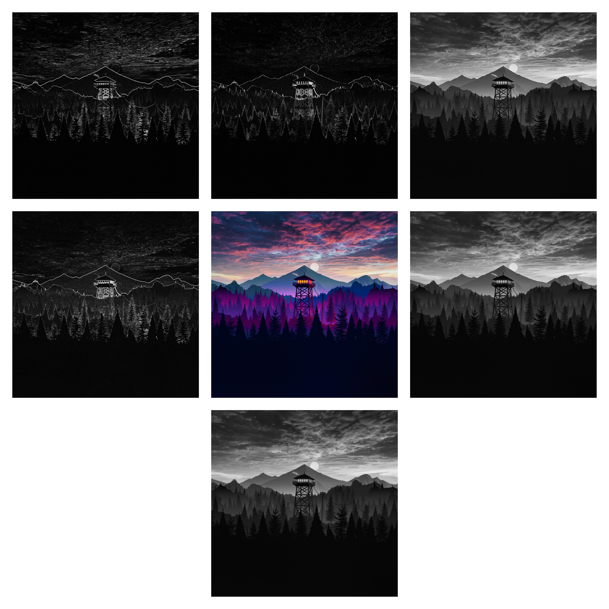

# 🧪 Taller - Ojos Digitales: Introducción a la Visión Artificial

## 📅 Fecha
`2025-05-03` – Fecha de realización del taller

---

## 🎯 Objetivo del Taller

Comprender y aplicar fundamentos de percepción visual artificial usando OpenCV: conversión a escala de grises, filtros convolucionales y detección de bordes, tanto en imágenes estáticas como en procesamiento en tiempo real con webcam.

---

## 🧠 Conceptos Aprendidos

- [ ] Conversión de imágenes a escala de grises
- [ ] Filtros convolucionales: blur y sharpen
- [ ] Detección de bordes: Sobel en X/Y y Laplaciano
- [ ] Procesamiento de video en tiempo real con webcam
- [ ] Controles interactivos con sliders (`cv2.createTrackbar`)

---

## 🔧 Herramientas y Entornos

- Python 3.x (`opencv-python`, `numpy`)
- OpenCV para procesamiento de imágenes y video
- `matplotlib` para visualizaciones adicionales


---

## 📁 Estructura del Proyecto

```
2025-05-06_taller_ojos_digitales/
├── Datos/                 # Carpeta con imágenes de entrada (firewatch.jpg)
├── python/                # notebook (visionArtificial.ipynb)
│   │──── visionArtificial # Código fuente
│   └── ...
├── Capturas/              # Imágenes procesadas guardadas automáticamente
├── README.md              # Documentación del taller
``` 

---

## 🧪 Implementación

### 🔹 Etapas realizadas
1. Carga de imagen RGB y conversión a escala de grises.
2. Aplicación de filtros convolucionales (Gaussian blur, sharpen).
3. Detección de bordes con filtros de Sobel en X/Y y Laplaciano.
4. Visualización estática de resultados con ventanas OpenCV.
5. Implementación de modo webcam con trackbars para ajustar tipo de filtro y tamaño de kernel en vivo.
6. Guardado automático de todas las variaciones en `Capturas/`.

### 🔹 Código relevante

```python
# Función central para aplicar distintos filtros
import cv2, numpy as np

def apply_filter(gray, ksize, filter_type):
    if filter_type == 0:  # Blur
        k = ksize if ksize%2 else ksize+1
        return cv2.GaussianBlur(gray,(k,k),0)
    elif filter_type == 2:  # Sobel X
        sob = cv2.Sobel(gray,cv2.CV_64F,1,0,ksize=ksize)
        return cv2.convertScaleAbs(sob)
    # ... otros filtros ...
```

---

## 📊 Resultados Visuales

Se incluye un GIF demostrando la aplicación de filtros en camara y detección de bordes en la imagen `firewatch.jpg`:
### 📌 GIF Animado


### 📌 Imagenes resultantes
 

Las imagenes por separado se encuentran adjutas comprimidas debido a su tamaño.

---

## 🧩 Prompts Usados

```text
"Cómo aplicar desenfoque gaussiano y filtros Sobel usando OpenCV en Python?"
"Implementar el procesamiento de imágenes en tiempo real con barras de seguimiento en OpenCV"
"Guarde las salidas de imágenes procesadas en el disco con cv2.imwrite"
```

---

## 💬 Reflexión Final

Este taller reforzó el entendimiento de cómo los computadores interpretan imágenes a nivel de píxel, aplicando filtros convolucionales y detectando bordes con diferentes técnicas. La parte más interesante fue ver en tiempo real cómo cambia el resultado al ajustar el tamaño del kernel y el tipo de filtro mediante sliders.

El mayor reto fue asegurar que los kernels tuvieran dimensiones impares para evitar errores en OpenCV y gestionar correctamente la captura de video en vivo. Para futuros proyectos, me gustaría explorar detección de contornos y segmentación semántica, así como integrar estos pasos en un pipeline de aprendizaje profundo.

