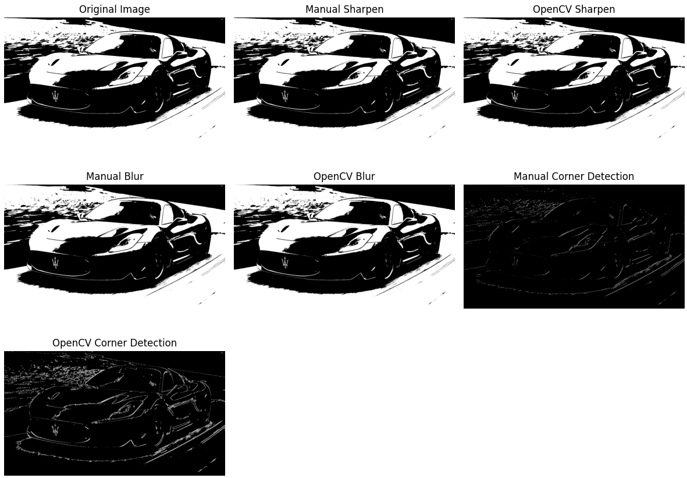

# 🧪 Taller - Filtro Visual: Convoluciones Personalizadas

## 📅 Fecha
`2025-05-04`

---

## 🔍 Objetivo del taller

Diseñar e implementar filtros personalizados en imágenes para modificar bordes, difuminar o realzar detalles. Este taller busca profundizar en el concepto de convolución y su impacto visual en el procesamiento de imágenes.

---

## 🧠 Conceptos Aprendidos

Lista de conceptos clave aplicados en el taller:

- [ ] Fundamentos matemáticos de la convolución 2D en imágenes
- [ ] Implementación manual de operaciones de convolución con NumPy
- [ ] Diseño de kernels personalizados para diferentes efectos visuales
- [ ] Técnicas de detección de bordes y esquinas usando derivadas direccionales
- [ ] Comparación entre implementación manual y bibliotecas optimizadas (OpenCV)
- [ ] Creación de interfaces interactivas para manipulación de parámetros en tiempo real

---

## 🔧 Herramientas y Entornos

- Python
- NumPy para operaciones con matrices
- OpenCV (cv2) para procesamiento de imágenes
- Matplotlib para visualización comparativa
- Interfaz interactiva con trackbars de OpenCV

---

## 📁 Estructura del Proyecto

```
2025-05-04_taller_convoluciones_personalizadas/
├── python/                 # Implementación en Python
│   ├── convoluciones.ipynb # Código principal del taller
│   ├── CAR2.PNG            # Imagen de prueba
│   └── ...
├── README.md               # Este archivo
```

---

## 🧪 Implementación

### 🔹 Filtros y Kernels

Se implementaron tres tipos principales de filtros mediante kernels personalizados:

1. **Enfoque (Sharpening)**: Resalta los detalles y bordes de la imagen.
   ```python
   sharpen_kernel = np.array([[0, -1, 0],
                             [-1, 5, -1],
                             [0, -1, 0]], dtype=np.float32)
   ```

2. **Suavizado (Blur)**: Reduce el ruido y difumina la imagen.
   ```python
   blur_kernel = np.ones((3, 3), dtype=np.float32) / 9.0
   ```

3. **Detección de Esquinas**: Combinación de derivadas direccionales para identificar cambios en dos direcciones.
   ```python
   # Usando Sobel X y Sobel Y
   sobel_x = np.array([[-1, 0, 1],
                       [-2, 0, 2],
                       [-1, 0, 1]], dtype=np.float32)
   
   sobel_y = np.array([[-1, -2, -1],
                       [0, 0, 0],
                       [1, 2, 1]], dtype=np.float32)
   ```

### 🔹 Convolución Manual vs OpenCV

La convolución manual fue implementada utilizando NumPy para entender los fundamentos del proceso:

```python
def apply_manual_convolution(image, kernel):
    kh, kw = kernel.shape
    pad_h, pad_w = kh // 2, kw // 2
    padded = np.pad(image, ((pad_h, pad_h), (pad_w, pad_w)), mode='reflect')
    windows = np.lib.stride_tricks.sliding_window_view(padded, (kh, kw))
    output = np.sum(windows * kernel, axis=(-2, -1))
    output = np.clip(output, 0, 255)
    return output.astype(np.uint8)
```

La principal diferencia con OpenCV radica en:
- OpenCV utiliza implementaciones altamente optimizadas en C++
- La versión manual permite entender el proceso paso a paso
- La función `sliding_window_view` de NumPy proporciona una forma eficiente de implementar la convolución sin bucles explícitos

### 🔹 Interfaz Interactiva

Se desarrolló una interfaz interactiva usando los trackbars de OpenCV para permitir al usuario experimentar con diferentes valores del kernel:

```python
def create_interactive_window(image):
    def update_dynamic_filter(val=None):
        center_value = cv2.getTrackbarPos('Center Weight', 'Dynamic Filter')
        edge_value = cv2.getTrackbarPos('Edge Weight', 'Dynamic Filter')
        
        center_value = max(1, center_value)
        edge_value = max(1, edge_value)
        
        dynamic_kernel = np.array([
            [0, -edge_value, 0],
            [-edge_value, center_value, -edge_value],
            [0, -edge_value, 0]
        ], dtype=np.float32)
        
        filtered_image = Convolution.apply_manual_convolution(image, dynamic_kernel)
        # ... displaying code ...
```

Esta interfaz permite modificar:
- El peso central del kernel (Center Weight)
- El peso de los bordes (Edge Weight)
- Visualizar los cambios en tiempo real

---

## 📊 Resultados Visuales

### 🌐 Filtros Básicos



*Comparación de los resultados de los filtros de enfoque, suavizado y detección de esquinas aplicados manualmente y con OpenCV.*

### 🌐 Interfaz Interactiva


*Demostración de la interfaz interactiva para ajustar los parámetros del kernel y ver los resultados en tiempo real.*

---

## 🧩 Prompts Usados

```text
"Cómo implementar una convolución 2D personalizada en NumPy"
"Optimización de operaciones de ventanas deslizantes en Python"
"Núcleos comunes de procesamiento de imágenes para la detección de bordes"
"Creación de barras de seguimiento interactivas con OpenCV Python"
"Comparación del procesamiento manual de imágenes con las funciones de OpenCV"

```

---

## 💬 Reflexión Final

Este taller proporcionó una comprensión de cómo funcionan las convoluciones en el procesamiento de imágenes digitales. La implementación manual permitió entender el proceso matemático subyacente, mientras que la comparación con OpenCV mostró la importancia de las bibliotecas optimizadas para aplicaciones prácticas.

Los principales aprendizajes fueron:
- La convolución es una operación fundamental en el procesamiento de imágenes que puede producir efectos visuales muy diferentes según el kernel utilizado
- El manejo de bordes (padding) es crucial para obtener resultados correctos en las convoluciones
- La detección de esquinas requiere combinar información de gradientes en múltiples direcciones
- NumPy proporciona herramientas eficientes para la implementación de algoritmos de procesamiento de imágenes

Dificultades encontradas:
- Optimizar la implementación manual para imágenes grandes
- Diseñar kernels personalizados para efectos específicos
- Balancear los parámetros en el filtro interactivo para obtener resultados visualmente agradables

Posibles mejoras futuras:
- Implementar filtros separables para mejorar la eficiencia
- Explorar kernels de mayor tamaño (5x5, 7x7)
- Añadir más opciones interactivas para manipular diferentes tipos de filtros
- Incorporar visualización en tiempo real de las frecuencias afectadas por cada filtro
